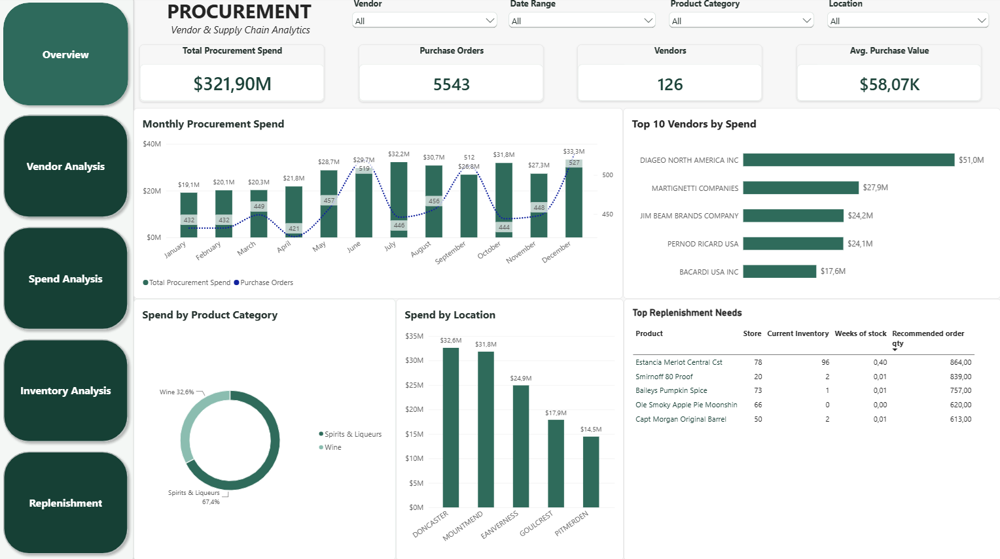
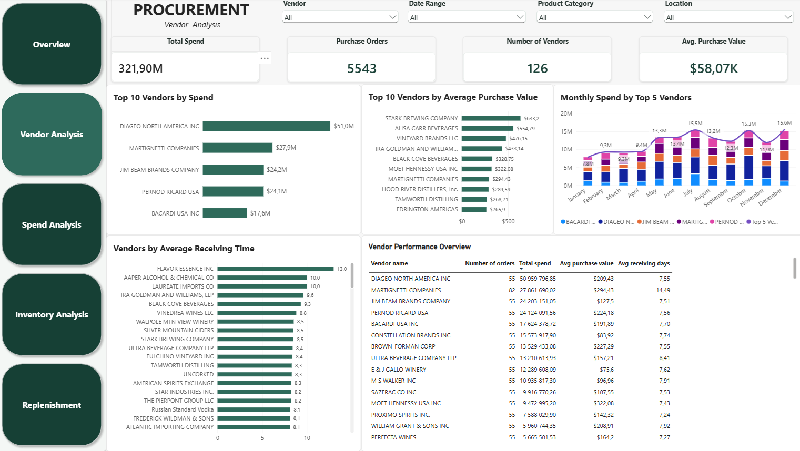
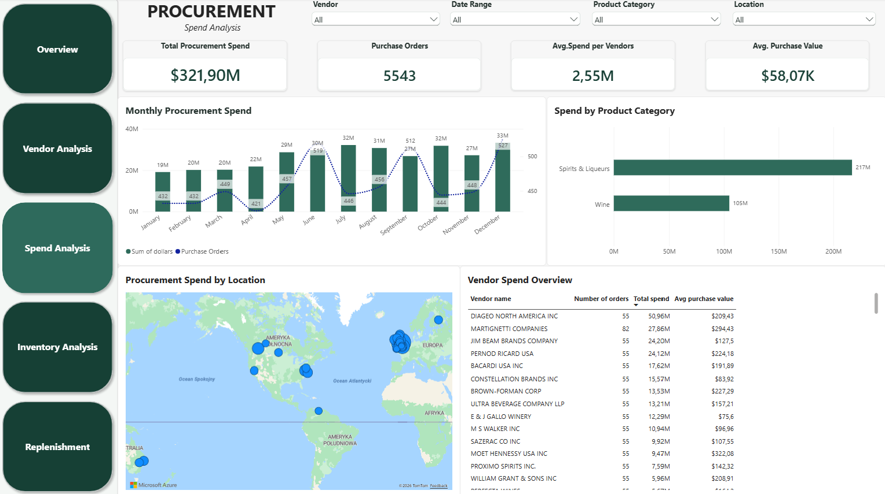
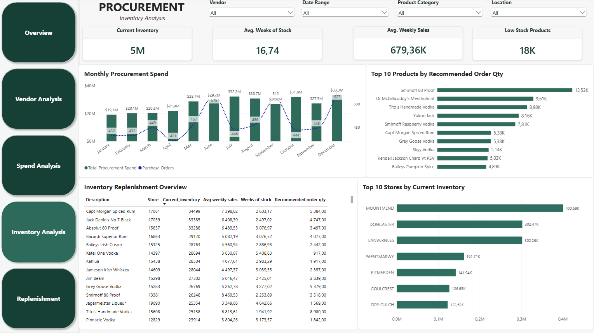
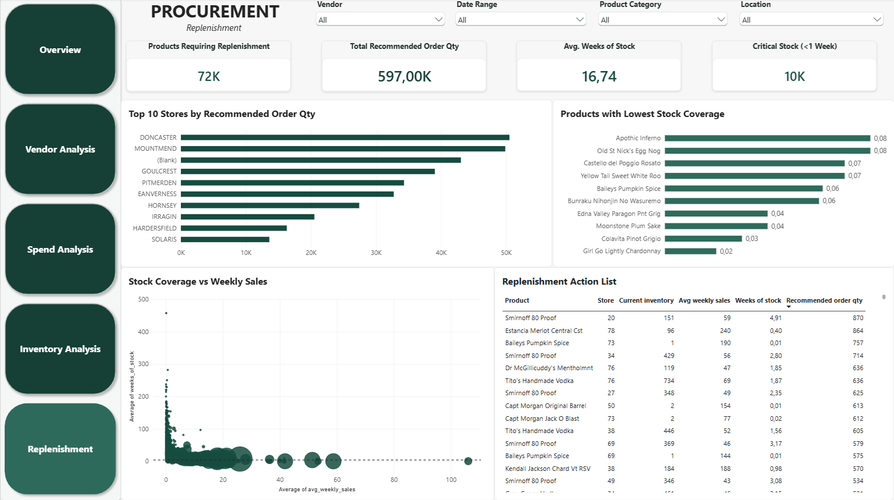

# Power-Bi-SQL-procurement-vendor-analysis
Procurement and vendor performance analysis using PostgreSQL, SQL and Power BI.
# Procurement & Vendor Performance Analysis

## Project Overview

This project analyzes procurement, vendor performance, purchasing activity and inventory replenishment using PostgreSQL, SQL and Power BI.

The goal of the project is to transform raw procurement, sales and inventory data into actionable insights supporting purchasing and inventory management decisions.

## Business Questions

The analysis focuses on the following questions:

- Which vendors generate the highest procurement spend?
- How concentrated is procurement spend across vendors?
- How much is spent on procurement over time?
- What are the average purchase and processing times?
- Which products require replenishment?
- Which locations have the highest inventory levels?
- Which products have the lowest stock coverage?
- How much stock should potentially be reordered based on recent sales activity?

## Tools & Technologies

- PostgreSQL
- SQL
- Power BI
- DAX
- Power Query
- GitHub

## Data Pipeline

Raw CSV data
→ PostgreSQL
→ SQL analysis & transformation
→ Power BI
→ Dashboard & business insights

## Data Sources

The project uses procurement, sales and inventory datasets containing information such as:

- Purchase orders
- Vendors
- Purchase prices
- Receiving and invoice dates
- Sales transactions
- Product information
- Store locations
- Beginning and ending inventory

The original datasets are not included in this repository due to file size limitations.

## SQL Analysis

The SQL analysis is organized into separate scripts covering:

- Data setup and exploration
- Vendor analysis
- Procurement spend analysis
- Price and margin analysis
- Purchase performance
- Inventory analysis
- Power BI views
- Replenishment analysis

The SQL scripts can be found in the `sql` folder.

## Power BI Dashboard

The Power BI dashboard contains five analytical pages:

### 1. Overview

Provides a high-level overview of procurement activity and key performance indicators.



### 2. Vendor Analysis

Analyzes vendor performance, procurement spend, number of orders and average purchase values.



### 3. Spend Analysis

Analyzes procurement spend over time, product categories, locations and vendors.



### 4. Inventory Analysis

Analyzes current inventory levels, weekly sales, stock coverage and recommended order quantities.



### 5. Replenishment

Identifies products and locations requiring replenishment and highlights products with low stock coverage.



## Key Analytical Concepts

### Vendor Performance

Vendor performance analysis includes:

- Total procurement spend
- Number of purchase orders
- Average purchase value
- Average receiving time
- Average invoice processing time
- Average payment time

### Inventory Replenishment

The replenishment analysis uses average weekly sales to estimate:

- Current inventory
- Average weekly sales
- Weeks of stock
- Target stock level
- Recommended order quantity

A four-week stock target is used as a planning assumption for the replenishment analysis.

### Stock Coverage

Weeks of stock is calculated as:

`Current Inventory / Average Weekly Sales`

Products with low stock coverage are highlighted to support replenishment prioritization.

## Project Structure

```text
Power-Bi-SQL-procurement-vendor-analysis/
│
├── sql/
│   ├── 00_purchase_prices_setup.sql
│   ├── 01_data_setup.sql
│   ├── 02_data_exploration.sql
│   ├── 03_vendor_analysis.sql
│   ├── 04_spend_analysis.sql
│   ├── 05_price_analysis.sql
│   ├── 06_purchase_performance.sql
│   ├── 07_inventory_analysis.sql
│   └── 08_views_for_powerbi.sql
│
├── powerbi/
│   ├── overview.png
│   ├── vendor_analysis.png
│   ├── spend_analysis.png
│   ├── inventory_analysis.png
│   └── replenishment.png
│
└── README.md
